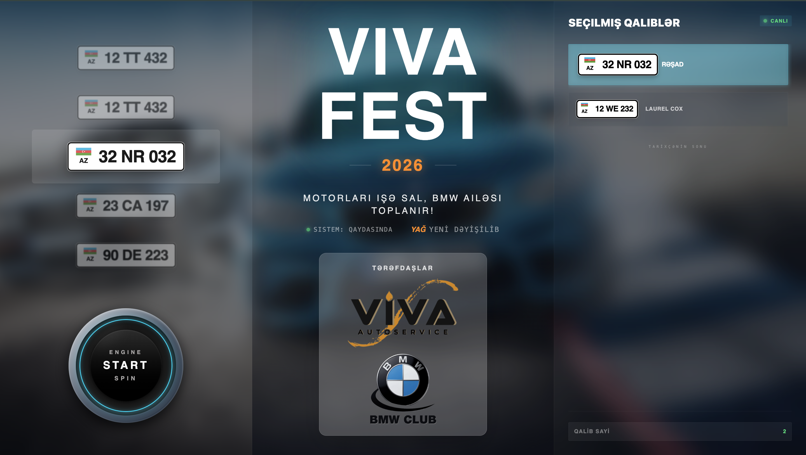
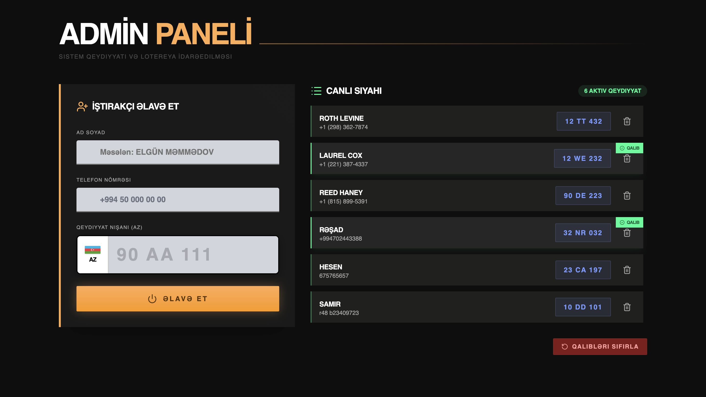

# 🚗 Viva Fest Lottery System

Interactive lottery system developed for **Viva Yağ Dəyişmə Mərkəzi** for use during the **Viva Fest 2026** event.

📅 **Event Date:** April 12, 2026
🎯 **Purpose:** Live on-screen lottery experience for selecting winning car plates during the festival.

---

## 📌 About the Project

This project is a full-screen interactive web application designed for large displays (4:3 format).
It simulates a dynamic lottery system where car plate numbers are randomly selected in real-time during the event.

The interface is built to create a **live шоу-эффект**, making the selection process engaging and visually appealing for the audience.

---

## ⚙️ Core Features

### 🎰 Lottery Roulette

* Infinite vertical scrolling (wheel-style, similar to iOS picker)
* Smooth animation with controlled acceleration and slowdown
* Always-filled list (no empty gaps)
* Random winner selection
* Highlighted winning plate with visual effects

---

### 🏁 Winners System

* Selected winners are stored and displayed in real-time
* Each new winner appears in a dedicated list
* Visual emphasis on the latest winner

---

### 📋 Admin Panel

* Add participants (Name, Car Plate, Phone)
* Delete participants
* Manage participant list easily

---

### 🔗 Backend Integration

* Data is not stored in local storage
* All participants are fetched from backend API (VivaFestAPI)
---

## 🧱 Project Structure

```
src/
 ├── components/      # UI components (roulette, plates, winners, etc.)
 ├── pages/           # MainPage, AdminPage
 ├── store/           # State management (lottery logic)
 ├── utils/           # Helpers
 ├── assets/          # Static files
```

---

## 🖥️ Main Screen

* Designed for large display (event screen)
* Split layout:

  * Left: Roulette
  * Center: Event branding
  * Right: Winners list


---

## 📱 Admin Panel

* Simple and responsive interface
* Used separately (e.g., from mobile device)



---

## 🎨 Design Concept

* Automotive-inspired UI
* Neon accents (blue, green, orange)
* Clean and readable from distance
* Focus on motion and interaction

---

## 🚀 Tech Stack

* React + Vite
* TypeScript
* TailwindCSS
* Embla Carousel (roulette engine)
* Zustand (state management)

---

## 🔐 Environment Variables

Create a `.env` file:

```
VITE_API_URL=Backend_URL
```

---

## ▶️ Running the Project

```bash
npm install
npm run dev
```
---

## 📌 Notes

* Designed specifically for live event usage
* Optimized for performance and stability
* Backend is intentionally simple (JSON-based)

---

## 🤝 Credits

Developed for **Viva Yağ Dəyişmə Mərkəzi**
For the **Viva Fest 2026** event
By Elvin Dzhavadov
